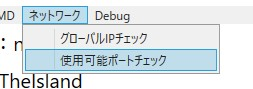

# ポートについて
ARKのゲームサーバーだろうが、ネットワークに関係するプログラムを使用・作成する時は、**ポート**に気を付けなければならないのはもう常識ですよね。

## ポートとは
ポートとは、いわば扉のようなものになります。  
説明するのが難しいんですけど...  
[どこかに、わかりそうでわからない、けど分かった気になれるような紹介ページ...ないかなぁ...？（口笛を吹きながら）](https://wa3.i-3-i.info/word1774.html)

## ARK Dedicated Serverで使用できるポートについて
Wikiの情報では、クエリーポートとして、`27020-27050`は利用できないようです。  

> `Query Port cannot be between 27020 and 27050 due to Steam using those ports.`  
> 引用元: [Dedicated server setup - ARK: Survival Evolved Wiki](https://ark.fandom.com/wiki/Dedicated_server_setup)  

でも普通に使える場合もあるらしいので今回は無視します(多分よろしくない())
  
そして、ネットワークの規則では下記のようにポートが決められています。  

> `WELL KNOWN PORT NUMBERS`:`0-1023`  
> IANAが使用目的を定めているポート  
>   
> `REGISTERED PORT NUMBERS`:`1024-49151`  
> IANAが管理しているが、登録されずに非公式に使われている場合もあるポート  
>  
> `DYNAMIC AND/OR PRIVATE PORTS`:`49152-65535`  
> ユーザーが自由に使えるポート  
>   
> (※<ruby>IANA<rp>(</rp><rt>アイアナ</rt><rp>)</rp></ruby>とは「<ruby>Internet Assigned Numbers Authority<rp>（</rp><rt>インターネット アサインド ナンバーズ オーソリティー</rt><rp>）</rp></ruby>」、インターネット番号割当機関として、IPアドレス・ドメイン名・ポート番号などの割り当て・管理を行う組織(又はICANNの機能の一部))  
> 引用元: [Internet Assigned Numbers Authority - Wikipedia](https://ja.wikipedia.org/wiki/Internet_Assigned_Numbers_Authority)  

上記から、`1024-49151`または`49152-65535`を使用すればいいと考えます。  
ですが、ポートを使うのはもちろんARK Dedicated Serverだけではないです。  
なんならARK: Serever Utilityもポート1個占有します。  
ってなわけで、使われていないポートを調べればいいんです。  

## 使用可能ポートを調べる
### ARK: Server Utilityを使用する方法
1. ARK: Server Utilityを開いてください。  
2. 画面上部のメニューの`ネットワーク`から`使用可能ポートチェック`を押します。  
  
3. 表示されたウィンドウ右下の`ポートチェック`を押します。  
  
4. 少し待つと、中央のテキストボックスに使用できるポートの一覧が表示されます。  
この一覧の中から`1024-`以降のポートを適当に探したりしてみてください。  
  
### コマンドを使う方法
1. Windows PowerShell又はコマンドプロンプトを開きます。
2. `netstat -an`と入力します
3. 表示されたポートが使用されているポートです。
4. この一覧に表示されてないポートから、いい感じに探してみてください。

(Wikiを見た感じはゲームポート`7777`、クエリ―ポート`27015`から順番にナンバリングしていくのがよさそうですね。)

## おわり
参考になったかどうかはおいておいて、まぁ良かったらこれからも楽しい~~ネットワーク系プログラミング~~ゲームライフを楽しんでください！  

---

```
2021/01/21 - 初版(@nattyan-tv)
```